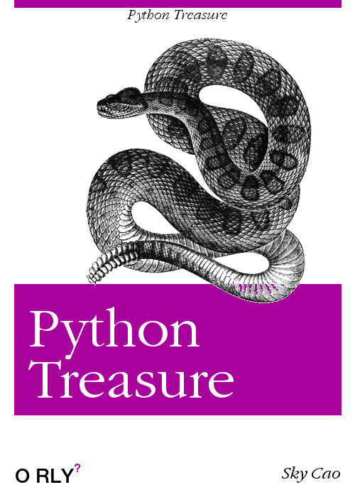

# python basic learning

## 简介

本书主要描述了python语言部分细节，其中一些问题有可能在面试中会遇到，那将会让你言简意赅的回答问题；有些问题你在工作会遇到，那非常好，你能幸运的绕开了这个坑；有些问题有可能在整个开发生涯中都不会注意到(CURD才是程序的真理），那也无所谓，抱着仅存的一点对技术的热爱，我们姑且多问一个为什么，又姑且回答一声，原来如此.....

## 第一章  什么是pythonic？请简单通俗的说说

## 第二章 数据类型

### 2.1 list
#### 问题 1、列表切片的问题，原理、越界、浅拷贝？
#### 问题 2、多维数组初始化问题？
#### 问题 3、循环中删增元素的问题？
#### 问题 4、增强型赋值与extend、append效率的问题？
#### 问题 5、列表在内存中是如何存储的？
#### 问题 6、内置函数sort、sorted、reverse、reversed、remove、pop、copy，怎么用需要注意哪些问题？

### 2.2 dict
#### 问题 1、字典初始化的方式有哪些，用{}初始化与用dict初始化有什么问题？
#### 问题 2、嵌套字典遍历，深度优先遍历，广度优先遍历？
#### 问题 3、有序字典，py3.7, 那么json封装后，再解压json，还是有序的吗？simplejson or json?
#### 问题 4、字典如何更pythonic的排序？
#### 问题 5、什么是字典key的可hash问题？

### 2.3 int, string, bool
#### 问题 1、if是如何判断变量为空的？
#### 问题 2、int可以有多长，如何实现的，还有long类型吗，除法/和//有什么不同？
#### 问题 3、str(),repr()有什么不同，join与'+'连接字符串哪个更有效率？

### 2.4 tuple, set
#### 问题 1、python中tuple如何初始化？
#### 问题 2、集合的优势有哪些，如何用？

### 2.5 iterator, generator, contextor

#### 问题 1、什么是迭代器，如何实现，如何判断是否可迭代？
#### 问题 2、什么是生成器和生成器函数，底层是如何实现的，有什么优势，哪些情况适合用生成器函数？
#### 问题 3、什么是上下文管理器，如何手动实现一个上下文管理器，哪些情景下适合用？

## 第三章 逻辑判断

### 3.1 for, while 
### 3.2 if/else

## 第四章 函数
### 4.1 参数及返回值
### 4.2 高阶函数，闭包
### 4.3 函数的属性

## 第五章 模块

### 5.1 模块导入及加载

## 第六章 异常

### 6.1 处理异常的原则
### 6.2 异常的陷阱

## 第七章 面向对象
### 7.1 类的创建
### 7.2 类的搜索
### 7.3 类方法

## 第八章 语法钩子
### 8.1 装饰器
### 8.2 元类
### 8.3 描述符
### 8.4 属性拦截

## 第九章 玩点设计模式
### 9.1 单例模式
### 9.2 mixin模式

## 第十章 代码规范
### 10.1 命名的确是个难题
### 10.2 代码review不应该是个形式

## 参考书籍
1、编写高质量代码:改善Python程序的91个建议  
2、Python学习笔记第二版   
3、Python学习手册第四版
